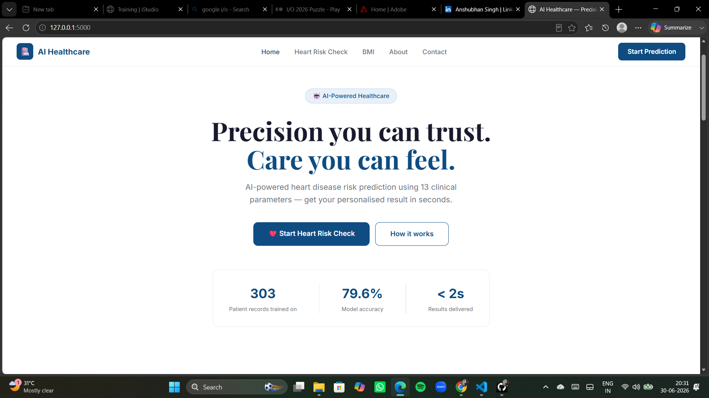
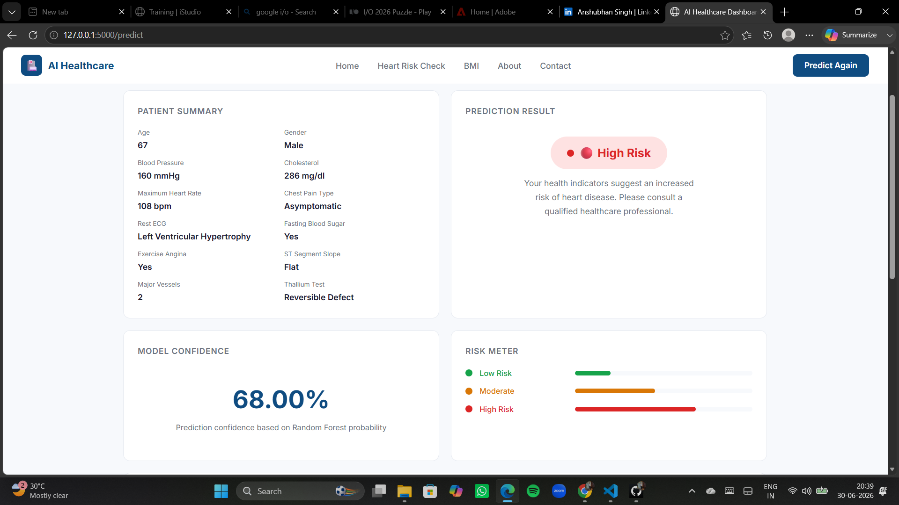
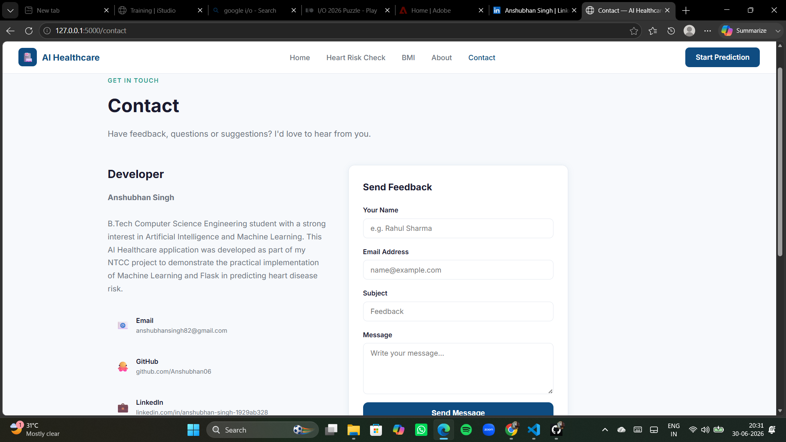

# 🏥 AI Healthcare - Heart Disease Risk Prediction

An AI-powered healthcare web application that predicts the likelihood of heart disease using Machine Learning. Built with **Python**, **Flask**, and **Scikit-learn**, the application provides an easy-to-use interface where users can enter clinical parameters and receive a heart disease risk assessment along with confidence scores and personalized health recommendations.

---

## 🚀 Features

- ❤️ Heart Disease Risk Prediction
- 🤖 Machine Learning powered prediction using Random Forest Classifier
- 📊 Interactive Prediction Dashboard
- 📈 Model Confidence Score
- 📉 Risk Meter Visualization
- 💡 AI-Based Health Recommendations
- ⚖️ BMI Calculator
- 📱 Fully Responsive User Interface
- 🌐 Flask Backend Integration
- 🔒 Educational use with Medical Disclaimer

---

## 🛠️ Tech Stack

### Frontend

- HTML5
- CSS3
- JavaScript

### Backend

- Python
- Flask

### Machine Learning

- Scikit-learn
- Random Forest Classifier
- NumPy
- Pandas
- Joblib

---

## 📂 Dataset

This project uses the **UCI Cleveland Heart Disease Dataset**.

It contains clinical attributes such as:

- Age
- Gender
- Chest Pain Type
- Blood Pressure
- Cholesterol
- Fasting Blood Sugar
- ECG Results
- Maximum Heart Rate
- Exercise Induced Angina
- Oldpeak
- Slope
- Number of Major Vessels
- Thalassemia

---

## 🧠 Machine Learning Model

Model Used:

- Random Forest Classifier

The model predicts whether a patient has a high or low risk of heart disease based on 13 clinical parameters.

---

## 📸 Screenshots

### Home Page



---

### Heart Risk check Page


---

### BMI Calculator


---

### Dashboard Page



---

### contact page



---

## 📁 Project Structure

```
AI-Healthcare/
│
├── dataset/
│   └── Heart_Disease_Prediction.csv
│
├── model/
│   └── heart_disease_model.pkl
│
├── static/
│   ├── css/
│   ├── js/
│   └── images/
│
├── templates/
│   ├── index.html
│   ├── predict.html
│   ├── dashboard.html
│   ├── bmi.html
│   ├── about.html
│   └── contact.html
│
├── app.py
├── train_model.py
├── dataset_analysis.py
├── requirements.txt
└── README.md
```

---

## ⚙️ Installation

### Clone the repository

```bash
git clone https://github.com/Anshubhan06/AI-Healthcare.git
```

### Move into the project directory

```bash
cd AI-Healthcare
```

### Install dependencies

```bash
pip install -r requirements.txt
```

### Run the Flask application

```bash
python app.py
```

Open your browser and visit:

```
http://127.0.0.1:5000
```

---

## 📊 Prediction Output

The application displays:

- Prediction Result
- Confidence Score
- Risk Meter
- Patient Summary
- AI Recommendations

---

## 📌 Future Improvements

- Diabetes Prediction
- Stroke Risk Prediction
- User Authentication
- Medical Report Generation (PDF)
- Database Integration
- Doctor Appointment System
- Cloud Deployment
- Wearable Device Integration

---

## 👨‍💻 Developer

**Anshubhan Singh**

B.Tech Computer Science Engineering

Artificial Intelligence & Machine Learning Enthusiast

📧 Email:
anshubhansingh82@gmail.com

🐙 GitHub:
https://github.com/Anshubhan06

💼 LinkedIn:
https://www.linkedin.com/in/anshubhan-singh-1929ab328/

---

## ⚠️ Disclaimer

This project is developed for **educational purposes only**.

The predictions generated by this application should **not** be considered medical advice or used as a substitute for professional diagnosis or treatment.

Always consult a qualified healthcare professional regarding any medical concerns.

---

## ⭐ If you found this project helpful, consider giving it a star!
